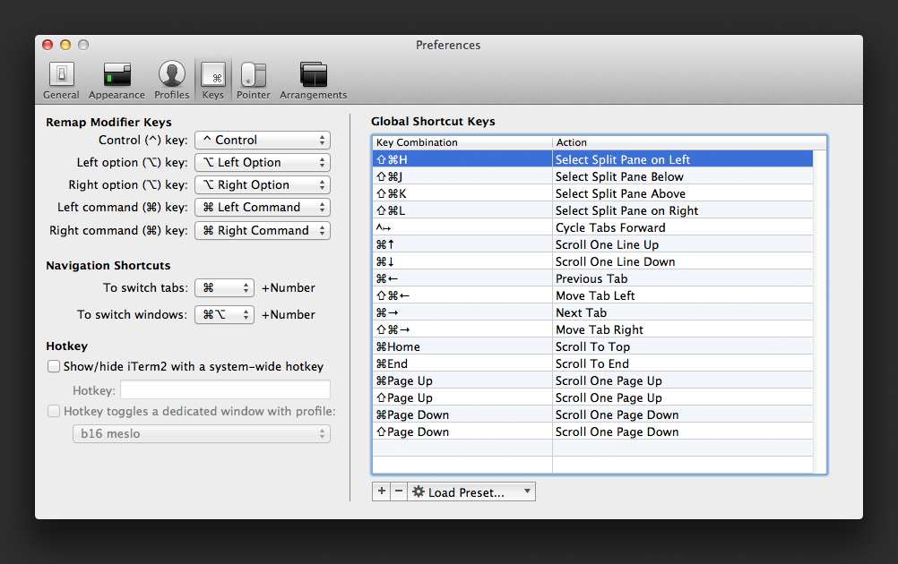
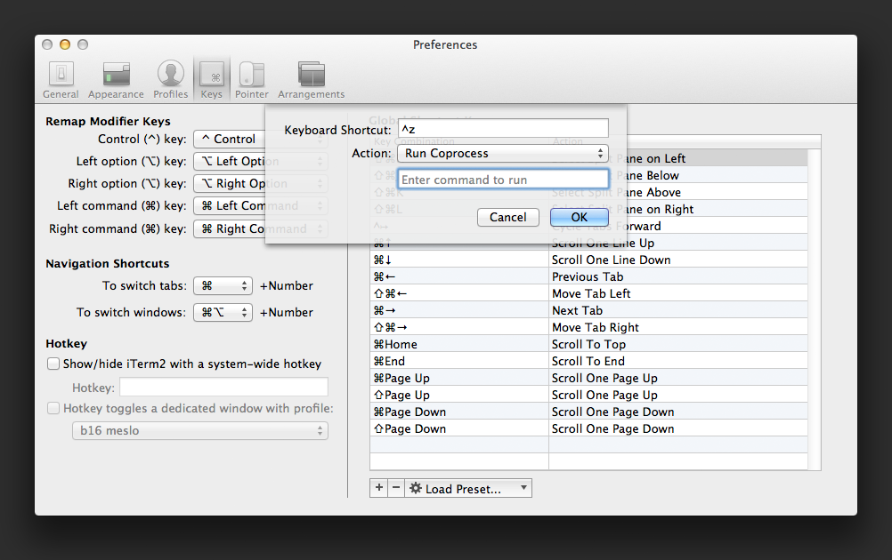
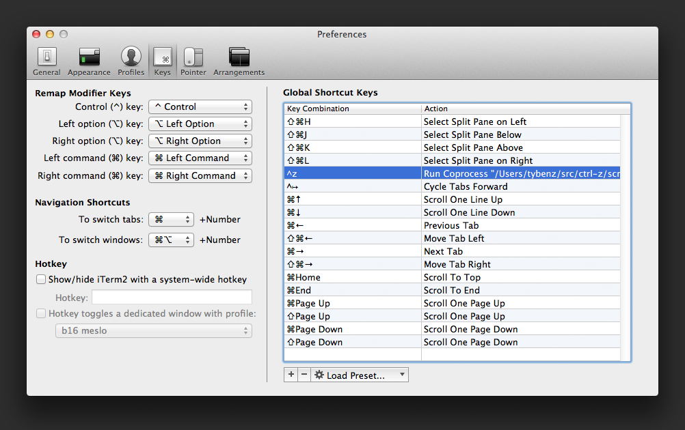

## CTRL-Z

This is a hack that allows me to use ctrl-z as a replacement for `fg` when
interacting with a backgrounded vim.

I use iTerm2 and my shell of choice is BASH. I had similar hacks for ZSH, but
wasn't about to switch over just to get this shortcut.

I'm using iTerm's keybinding/coprocess feature to conditionally send `fg<CR>`
to the terminal when `^z` is pressed.

# Get Started

Take a look at script.sh to see how simple it is, & follow the instructions
below to set up the key binding:

Open iTerm Preferences and click on **Keys**.

Click the **+**, hit `^z`, select **Run Coprocess**, & type in the path to
   `script.sh`.

Hit enter and you're done.

